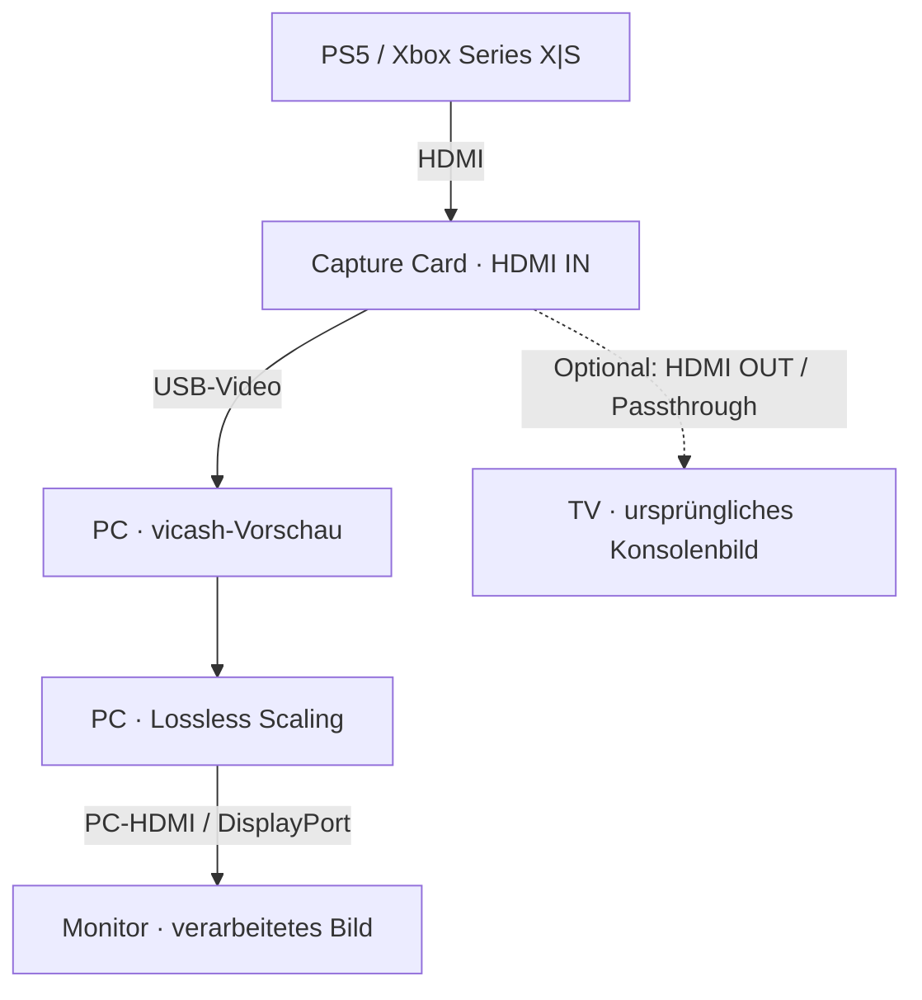
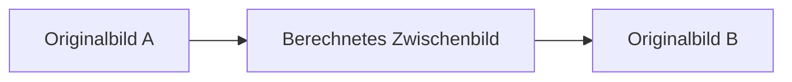

# 🎮 FrameHeist

### Flüssigeres Konsolenbild mit Capture Card und Lossless Scaling

**🌐 Sprache: [🇬🇧 English](README.md) · Deutsch**

Mit HDMI-Capture und Frame Generation lässt sich ein Konsolenbild auf dem PC flüssiger darstellen. Diese Anleitung entsteht mit Blick auf GTA VI auf PS5 / Xbox Series X|S; das Grundprinzip lässt sich auch mit anderen Konsolenspielen erproben.

> [!IMPORTANT]
> **In Arbeit · Erste Fassung · 15. September 2026**
>
> Konzept und Ausstattung sind dokumentiert. Konkrete Einstellungen und Praxistests stehen noch aus. „30 → 60 FPS“ ist ein beispielhaftes Ziel, kein bestätigtes GTA-VI-Ergebnis und keine Aussage über dessen Bildrate auf Konsolen.

**Direkt zu:** [Funktionsweise](#how-it-works) · [Ausstattung](#equipment) · [Einrichtung](#setup) · [Nächste Schritte](#next-steps)

## ✨ So funktioniert es

Das Spiel läuft auf der Konsole. Eine Capture Card überträgt deren HDMI-Bild an den PC, wo **vicash** eine Vorschau anzeigt. **Lossless Scaling** verarbeitet diese Vorschau und erzeugt Zwischenbilder für die Ausgabe auf dem PC-Monitor.

**Gespielt wird mit Blick auf die PC-Ausgabe.** Ein Fernseher am optionalen Passthrough-Ausgang der Karte erhält das ursprüngliche Konsolensignal ohne die am PC erzeugten Zwischenbilder. Dein Controller bleibt mit der Konsole verbunden.

### Was „30 → 60 FPS“ bedeutet

Frame Generation erzeugt zusätzliche Bilder zwischen den Ausgangsbildern. Eine ideale Verdopplung sieht schematisch so aus:

Das Spiel berechnet seine Spielwelt und Originalbilder weiterhin mit der ursprünglichen Rate. Bewegungen können flüssiger aussehen, reagieren aber nicht wie bei nativen 60 FPS. Aufnahme, Vorschau und Verarbeitung können Verzögerung hinzufügen; an bewegten Objekten oder Bedienelementen können Bildfehler entstehen.

> [!NOTE]
> **Spiel-FPS, Capture-FPS und Monitor-Hz sind unterschiedliche Werte.** Ein Capture-Stream mit 60 FPS kann wiederholte Bilder eines 30-FPS-Spiels enthalten. Eine 2×-Einstellung garantiert deshalb nicht automatisch 60 unterschiedliche, gleichmäßig verteilte Bilder. Dieses Zusammenspiel zwischen Aufnahme und Frame Generation muss für die Anleitung noch getestet werden.

## 🧰 Das brauchst du

| Bestandteil | Zweck / Auswahlhilfe |
| --- | --- |
| PS5 oder Xbox Series X\|S | Führt das Spiel aus und liefert das HDMI-Signal. |
| HDMI Capture Card | Überträgt das Bild per USB an den PC. Prüfe **Auflösung und Bildrate der USB-Aufnahme** getrennt von HDMI-Eingang und Passthrough. |
| Windows-PC mit freien GPU-Ressourcen | Lossless Scaling nennt RTX 30, RX 6000 und Intel Arc als empfohlene GPU-Familien; das sind keine festen Mindestanforderungen. Siehe die [aktuellen Systemanforderungen](https://store.steampowered.com/app/993090/Lossless_Scaling/). |
| [vicash](https://github.com/caaatto/vicash) | Kostenlose Software für die Capture-Vorschau. Download über die [Releases des Projekts](https://github.com/caaatto/vicash/releases). |
| [Lossless Scaling](https://store.steampowered.com/app/993090/Lossless_Scaling/) | Kostenpflichtige Software mit LSFG Frame Generation. Den aktuellen regionalen Preis findest du auf Steam. |
| Monitor am PC und passende Kabel | Mindestens 60 Hz für ein Ausgabeziel von 60 FPS. Höhere Ziele benötigen auch einen passenden Anzeigemodus und genügend PC-Leistung. |

Benötigt werden eine HDMI-Verbindung von der Konsole zur Karte, eine geeignete USB-Verbindung von der Karte zum PC und eine Bildverbindung vom PC zum Monitor. Für den oben gezeigten Grundaufbau ist kein HDMI-Splitter nötig.

🛒 Capture-Card-Kandidaten aus der Rohfassung

Diese Modelle sind Recherchekandidaten, **noch keine getesteten Empfehlungen**. Die folgenden Preise und Modusangaben stammen aus den ursprünglichen Notizen; Produktspezifikationen und aktuelle Preise konnten für diesen Entwurf nicht unabhängig bestätigt werden.

| Kandidat | Preis aus der Rohfassung | Modusangabe aus der Rohfassung — Aufnahmefähigkeit ungeprüft |
| --- | --- | --- |
| [UGREEN · B0DT9DY312](https://www.amazon.de/dp/B0DT9DY312) | ca. 16 € | 1080p / 60 Hz |
| [UGREEN · B0DGXJS6BF](https://www.amazon.de/dp/B0DGXJS6BF) | ca. 22 € | „2K“ / 30 Hz |
| [UGREEN · B0D4LV836Z](https://www.amazon.de/dp/B0D4LV836Z) | ca. 72 € | 4K / 60 Hz |

Prüfe vor dem Kauf die USB-Aufnahmemodi, den benötigten USB-Anschluss und die Audio-Unterstützung des genauen Modells. „4K“ kann sich auf HDMI-Eingang oder Passthrough statt auf die USB-Aufnahme beziehen. „2K“ allein legt die tatsächliche Pixelauflösung nicht eindeutig fest.

## 🔌 Einrichtung — vorbereitender Entwurf

Der folgende Ablauf ist ein Einstieg, **noch keine vollständig getestete Konfiguration**.

### 1. Geräte verbinden

Verbinde den HDMI-Ausgang der Konsole mit **HDMI IN** der Capture Card und anschließend die Karte per USB mit dem PC. Verwende den am PC angeschlossenen Monitor für das verarbeitete Bild.

### 2. Vorschau zum Laufen bringen

Öffne vicash und wähle die Capture Card. Laut Dokumentation öffnet **F1** die Einstellungen; **F11** aktiviert den randlosen Vollbildmodus. Prüfe Bild und Ton, bevor du Frame Generation hinzunimmst. Siehe die [vicash-Dokumentation](https://github.com/caaatto/vicash).

### 3. Frame Generation vorbereiten

Lossless Scaling unterstützt Fenster und randloses Vollbild sowie feste Multiplikation oder eine adaptive Zielbildrate. Den genauen Modus, die Capture-Einstellungen und die Aktivierungsfolge für diesen Konsolenaufbau ergänzen wir nach dem Test. Siehe die [offizielle Softwarebeschreibung](https://store.steampowered.com/app/993090/Lossless_Scaling/).

### 4. Ergebnis überprüfen

Vergleiche dieselbe langsame Kamerabewegung mit und ohne Verarbeitung. Achte auf flüssige Bewegung, Controller-Reaktion, Bildfehler und synchronen Ton. Notiere Konsolenmodus, Capture-Modus, Monitor-Bildwiederholrate, Grafikkarte und Softwareversionen zusammen mit den Ergebnissen.

**Erstes Ziel:** eine stabile, visuell überprüfte Ausgabe mit 60 FPS aus einer geeigneten 30-FPS-Quelle. Höhere Ziele folgen erst, wenn diese Grundlage funktioniert.

## 🚧 Was fehlt noch?

- [x] Prinzip und Grenzen erklären.
- [x] Ausstattung und Capture-Card-Kandidaten strukturieren.
- [x] Englische und deutsche Fassung mit Anschlussdiagrammen bereitstellen.
- [ ] Capture-Card-Spezifikationen prüfen und mindestens einen Aufbau testen.
- [ ] Konsolen-Bildeinstellungen einschließlich PS5-HDCP-Handhabung dokumentieren.
- [ ] Getestete vicash- und Lossless-Scaling-Einstellungen mit Screenshots ergänzen.
- [ ] Wiederholte Ausgangsbilder, gleichmäßige Bildabstände, Latenz und Tonsynchronität prüfen.
- [ ] Fehlerbehebung und, sobald verfügbar, GTA-VI-Testergebnisse ergänzen.

### 📚 Quellen

Softwareangaben geprüft am 15. September 2026: [vicash-Projektdokumentation](https://github.com/caaatto/vicash) und [Lossless Scaling auf Steam](https://store.steampowered.com/app/993090/Lossless_Scaling/). Die Hardwarekandidaten stammen aus den Arbeitsnotizen des Projekts. Diese Version enthält keine Hardwaretests oder GTA-VI-Messungen.

---

Unabhängige Community-Anleitung. Keine Verbindung zu Rockstar Games, Sony, Microsoft, UGREEN oder den Softwareentwicklern.
