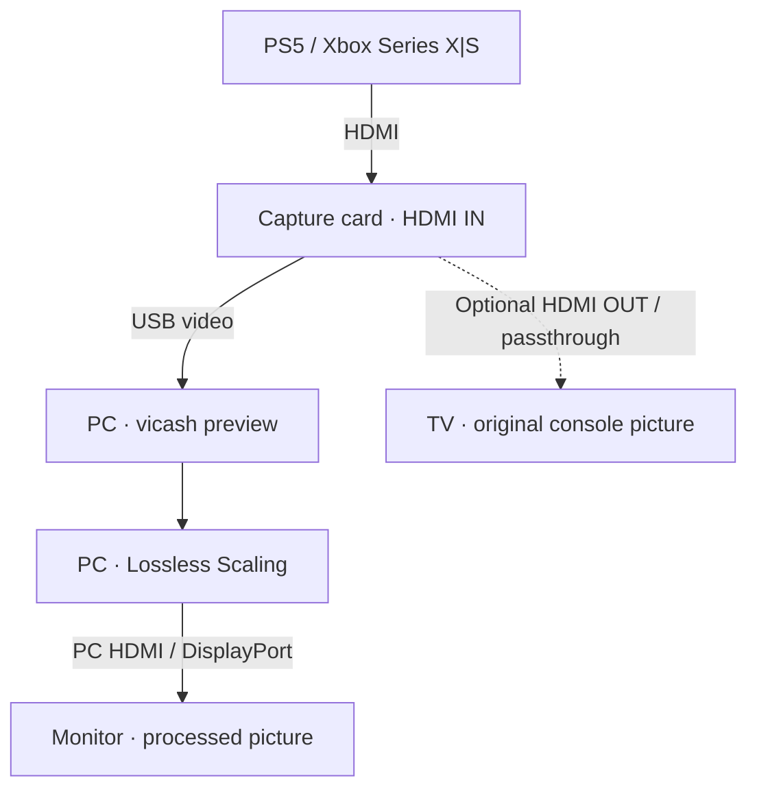
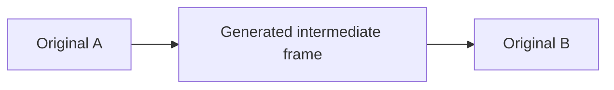

# 🎮 FrameHeist

### Smoother console gameplay with a capture card and Lossless Scaling

**🌐 Language: English · [🇩🇪 Deutsche Anleitung](README.de.md)**

Turn a console video feed into a smoother-looking PC display using HDMI capture and frame generation. This guide is being developed with GTA VI on PS5 / Xbox Series X|S in mind; the basic approach can also be explored with other console games.

> [!IMPORTANT]
> **Work in progress · First draft · September 15, 2026**
>
> The concept and equipment list are documented. Exact settings and practical validation are still pending. “30 → 60 FPS” is an example target, not a verified GTA VI result or a claim about its console frame rate.

**Quick navigation:** [How it works](#how-it-works) · [Equipment](#equipment) · [Setup](#setup) · [Next steps](#next-steps)

## ✨ How it works

The console runs the game. A capture card sends its HDMI video to the PC, where **vicash** shows a preview. **Lossless Scaling** processes that preview and generates intermediate frames for display on the PC monitor.

**Play while looking at the PC output.** A TV connected to the card's optional passthrough output receives the original console signal, without the frames generated on the PC. Your controller stays connected to the console.

### What “30 → 60 FPS” means

Frame generation creates intermediate pictures between the source frames. Conceptually, an ideal doubling looks like this:

The game still simulates and renders at its original rate. Movement may look smoother, but it does not gain the responsiveness of native 60 FPS. Capture, preview and processing can add delay, and generated frames can show visual errors around moving objects or interface elements.

> [!NOTE]
> **Game FPS, capture FPS and monitor Hz are different.** A 60 FPS capture stream can contain repeated frames from a 30 FPS game. Applying a 2× setting to that stream does not automatically prove that the result contains 60 distinct, smoothly spaced pictures. This capture-to-generation behavior still needs testing for this guide.

## 🧰 What you need

| Item | Purpose / selection advice |
| --- | --- |
| PS5 or Xbox Series X\|S | Runs the game and provides the HDMI signal. |
| HDMI capture card | Sends video to the PC over USB. Check the **USB capture resolution and frame rate**, separately from HDMI input and passthrough specifications. |
| Windows PC with GPU headroom | Lossless Scaling lists RTX 30, RX 6000 and Intel Arc as recommended GPU families; these are not strict minimums. See the [current system requirements](https://store.steampowered.com/app/993090/Lossless_Scaling/). |
| [vicash](https://github.com/caaatto/vicash) | Free capture preview software. Download via the project's [releases](https://github.com/caaatto/vicash/releases). |
| [Lossless Scaling](https://store.steampowered.com/app/993090/Lossless_Scaling/) | Paid software providing LSFG frame generation. Check Steam for your current regional price. |
| PC-connected monitor and cables | At least 60 Hz for a 60 FPS display target. Higher targets also need a suitable display mode and enough PC performance. |

You need an HDMI connection from console to card, a suitable USB connection from card to PC, and a display connection from PC to monitor. An HDMI splitter is not required for the basic path shown above.

🛒 Capture-card candidates from the original draft

These are research candidates, **not yet tested recommendations**. The prices and mode labels below come from the original notes; the product specifications and current prices could not be independently verified for this draft.

| Candidate | Draft price | Draft mode label — capture capability unverified |
| --- | --- | --- |
| [UGREEN · B0DT9DY312](https://www.amazon.de/dp/B0DT9DY312) | ≈ €16 | 1080p / 60 Hz |
| [UGREEN · B0DGXJS6BF](https://www.amazon.de/dp/B0DGXJS6BF) | ≈ €22 | “2K” / 30 Hz |
| [UGREEN · B0D4LV836Z](https://www.amazon.de/dp/B0D4LV836Z) | ≈ €72 | 4K / 60 Hz |

Before buying, verify the exact model's USB capture modes, required USB connection and audio support. “4K” may describe HDMI input or passthrough rather than USB recording. “2K” alone does not establish the actual pixel resolution.

## 🔌 Setup — preparation draft

The following is a starting workflow, **not yet a tested end-to-end preset**.

### 1. Connect the equipment

Connect the console's HDMI output to the capture card's **HDMI IN**, then connect the card to the PC via USB. Use the PC-connected monitor for the processed picture.

### 2. Establish a working preview

Open vicash and select the capture card. Its documented shortcuts are **F1** for settings and **F11** for borderless fullscreen. Check picture and sound before adding frame generation. See the [vicash documentation](https://github.com/caaatto/vicash).

### 3. Prepare frame generation

Lossless Scaling supports windowed and borderless applications, and offers fixed multiplication or an adaptive target frame rate. The exact mode, capture settings and activation sequence for this console workflow will be documented after testing. See the [official software description](https://store.steampowered.com/app/993090/Lossless_Scaling/).

### 4. Validate the result

Compare the same slow camera movement with processing off and on. Check visual smoothness, controller response, picture errors and audio sync. Record the console mode, capture mode, monitor refresh rate, GPU and software versions alongside the results.

**First target:** a stable, visually verified 60 FPS output from a suitable 30 FPS source. Explore higher targets only once the baseline works.

## 🚧 What is still missing?

- [x] Explain the approach and its limitations.
- [x] Organize equipment and capture-card candidates.
- [x] Provide English and German versions with connection diagrams.
- [ ] Verify capture-card specifications and test at least one setup.
- [ ] Document console video settings, including PS5 HDCP handling.
- [ ] Add tested vicash and Lossless Scaling settings with screenshots.
- [ ] Check repeated source frames, frame pacing, latency and audio sync.
- [ ] Add troubleshooting and, when available, GTA VI test results.

### 📚 Sources

Software information checked on September 15, 2026: [vicash project documentation](https://github.com/caaatto/vicash) and [Lossless Scaling on Steam](https://store.steampowered.com/app/993090/Lossless_Scaling/). Hardware candidates originate from the project's working notes. No hardware tests or GTA VI measurements are included in this version.

---

Independent community guide. Not affiliated with Rockstar Games, Sony, Microsoft, UGREEN or the software developers.
