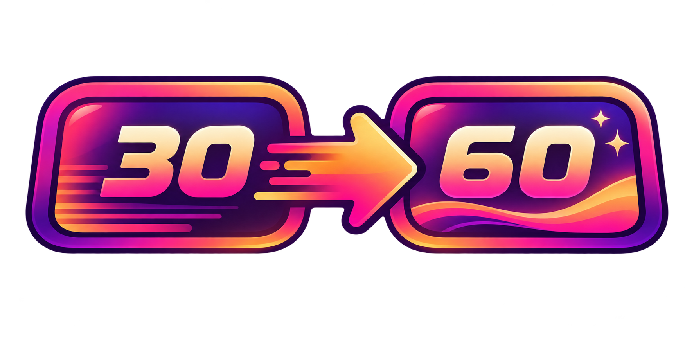
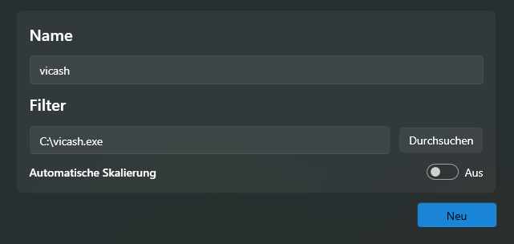
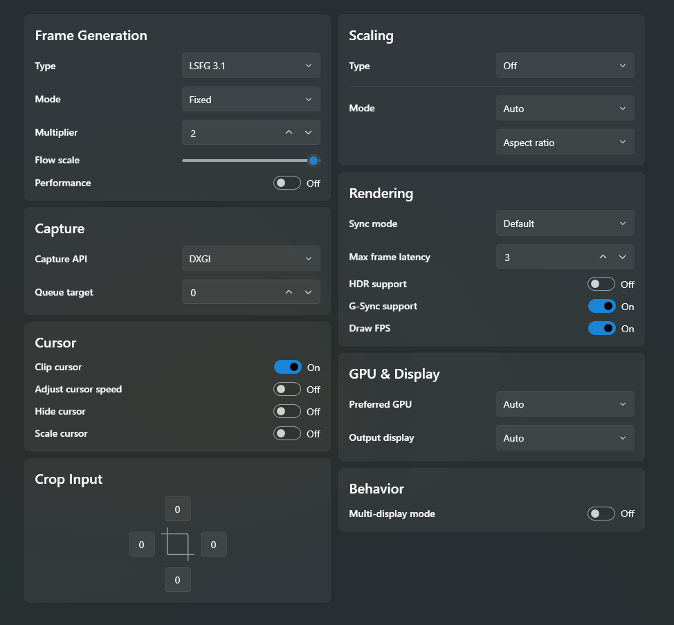

  

<h1 align="center">GTA VI 30 to 60 FPS Guide</h1>

  <strong>Make 30 FPS console games look smoother at 60 FPS or more</strong> 
  GTA VI · PS5 · Xbox Series X|S

  🌐 <strong>English</strong> &nbsp; | &nbsp; <a href="README.de.md"><strong>🇩🇪 Deutsche Anleitung</strong></a>

  <a href="https://celduinx.github.io/GTA-VI-30-to-60-FPS-Guide/"><strong>🌐 Open the complete interactive web guide</strong></a>

  <a href="#demo">🎥 Demo</a> &nbsp;•&nbsp;
  <a href="#requirements">🧰 What you need</a> &nbsp;•&nbsp;
  <a href="#capture-card">🛒 Capture card</a> &nbsp;•&nbsp;
  <a href="#vicash">🖥️ vicash</a> &nbsp;•&nbsp;
  <a href="#lossless-scaling">🚀 Lossless Scaling</a>

---

This guide shows you how to make console gameplay look smoother with a **capture card**, a **Windows PC**, **vicash** and **Lossless Scaling**. GTA VI is the focus of this project, but the same method also works with other console games.

The capture card brings the console picture to your PC. **vicash** displays it, while **Lossless Scaling** creates additional frames between the originals. You continue to play with the controller connected to your console.

> [!NOTE]
> The picture looks smoother, but the console itself does not run faster. Frame generation can add a little latency and may occasionally cause visual artifacts.

## 🎥 See it in action

This side-by-side demo shows **Assassin’s Creed Mirage on PS5** at the original 30 FPS compared with a 60 FPS output created by Lossless Scaling.

  

  <a href="https://www.youtube.com/watch?v=ntizJL75VQM"><strong>▶️ Watch the 30 FPS vs. 60 FPS demo on YouTube</strong></a>

## 1️⃣ What you need

### Hardware

- 🎮 **Console:** PS5 or Xbox Series X|S
- 🔌 **Capture card:** HDMI model with matching HDMI and USB cables
- 🖥️ **PC:** Windows, with a suitable graphics card
- 📺 **Monitor:** connected to the PC, with at least 60 Hz

[Recommended graphics cards](https://store.steampowered.com/app/993090/Lossless_Scaling/): NVIDIA RTX 30 series, AMD RX 6000 series or Intel Arc.

### Software

| App | Purpose | Download |
| --- | --- | --- |
| **vicash** | Displays the console picture on your PC | [Download for free](https://github.com/caaatto/vicash/releases) |
| **Lossless Scaling** | Generates additional frames for smoother movement | [Buy on Steam](https://store.steampowered.com/app/993090/Lossless_Scaling/) |

## 2️⃣ Choose a capture card

Compare these three UGREEN models and choose the one that best fits your target resolution:

| UGREEN model | Capture on PC | PC connection | HDMI passthrough | Guide price* | Shop |
| --- | --- | --- | --- | ---: | --- |
| [15389](https://www.amazon.com/dp/B0DT9DY312) | 1080p / 60 FPS 2K / 30 FPS | USB-A / USB-C USB 3.0 | — | ≈ €16 | [Amazon.de](https://www.amazon.de/dp/B0DT9DY312) |
| [25773](https://www.amazon.com/dp/B0DGXJS6BF) | 1080p / 60 FPS 2K / 30 FPS | USB-A / USB-C USB 3.0 | 4K / 30 Hz | ≈ €22 | [Amazon.de](https://www.amazon.de/dp/B0DGXJS6BF) |
| [25173](https://www.amazon.com/dp/B0D4LV836Z) | 4K / 60 FPS 2K / 144 FPS 1080p / 240 FPS | USB-A / USB-C USB 3.0 | 4K / 60 Hz | ≈ €72 | [Amazon.de](https://www.amazon.de/dp/B0D4LV836Z) |

> [!TIP]
> For this guide, **Capture on PC** is the most important column. HDMI passthrough only sends the original console picture to a separate display — without the extra frames from Lossless Scaling.

*Prices are estimates from the original shortlist, not live offers. Capture modes are manufacturer ratings. Check Amazon.de for current prices.

## 3️⃣ Configure vicash

Open the settings with **F1**, then apply these values from top to bottom.

### 🖥️ Display

- **Mode:** `Immediate` — no V-Sync and the lowest latency

### 📷 Capture

- **Device:** `UGREEN Capture Card`
- **Resolution:** `1920 × 1080` or `2560 × 1440` — use the highest resolution supported by your PC monitor
- **FPS:** `30`

### 🔊 Audio

- **Input:** `UGREEN Capture Card`
- **Output:** your PC speakers or headphones
- **Volume:** increase it if the PS5 is too quiet
- **Sync delay:** `100 ms` (default)

<strong>⌨️ Useful vicash hotkeys</strong>

| Key | Action |
| --- | --- |
| **F1** | Open settings |
| **F11** | Toggle fullscreen |
| **Esc** | Exit fullscreen |

## 4️⃣ Configure Lossless Scaling

### Step 1 — Create a vicash profile

Create a new profile called **vicash**, select **vicash.exe** as the application and leave automatic scaling turned off.

   
  Profile name and application filter for vicash

### Step 2 — Apply the settings

> [!IMPORTANT]
> Set the **Multiplier to 2** to turn a 30 FPS input into a smoother 60 FPS output.

#### 🎞️ Frame Generation

- **Type:** `LSFG 3.1`
- **Mode:** `Fixed`
- **Multiplier:** `2`
- **Performance:** `Off`
- **Flow scale:** use the value below

| Full HD · 1920 × 1080 | 2K · 2560 × 1440 | 4K · 3840 × 2160 |
| :---: | :---: | :---: |
| **100** | **75–100** | **50–67** |

#### 🔲 Scaling

- **Type:** `Off`

#### 📥 Capture

- **Capture API:** `DXGI`
- **Queue target:** `0`

#### 🎨 Rendering

- **Sync mode:** `Default`
- **Max frame latency:** `3`
- **HDR support:** `Off`
- **G-Sync support:** `On` if your monitor supports G-Sync or FreeSync
- **Draw FPS:** `On` or `Off` — enable it to display the original and generated FPS

   
  Recommended Lossless Scaling settings for the vicash profile

